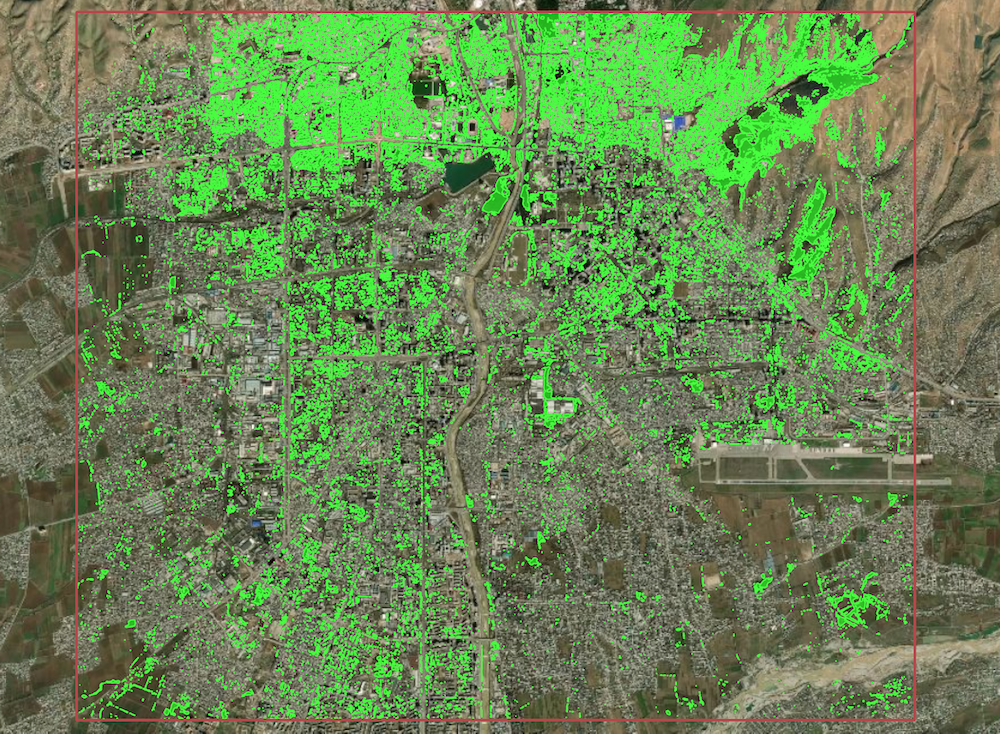
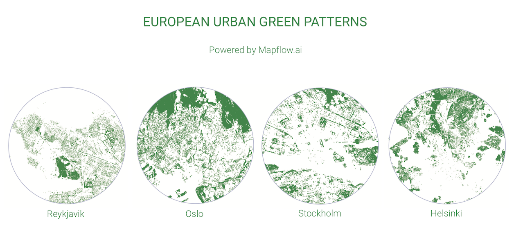
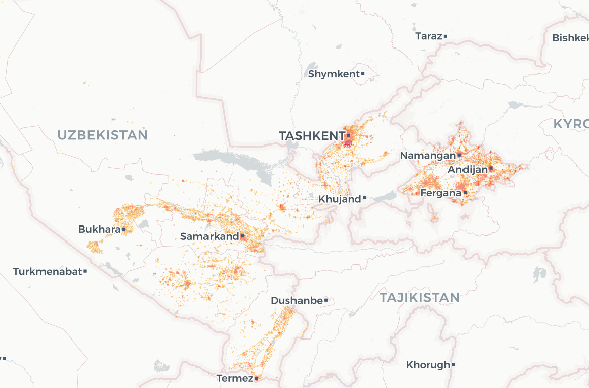

# Open Urban Mapping

Introduction
------------
This project was mainly aimed at demonstrating "AI-Mapping" leveraging AI technologies to analyse and digitize aerial and satellite imageru. As soon as there are more tools and more open data available we reviewed the concept to share specific datasets with the community. It is dedicated to analysis of urban environment and land resources as well as to the wide range of educational and resesrch projects.

## Open Datasets

### Vegetation in cities ###

| Region | Name | Area | Download |
|-------------|------------|----------|----------|
|Central Asia| **5 cities - central areas** | 5*100km² | [Geojson, 84Mb](https://minio-production.mapflow.ai/public/data/5cities_central_Asia_vegetation.gpkg.zip?Content-Disposition=attachment%3B%20filename%3D%22data%2F5cities_central_Asia_vegetation.geojson.zip)  [GeoPackage, 66Mb](https://minio-production.mapflow.ai/public/data/5cities_central_Asia_vegetation.gpkg.zip?Content-Disposition=attachment%3B%20filename%3D%22data%2F5cities_central_Asia_vegetation.gpkg.zip) |

👉 [Download this PDF showing green patterns in European cities](images/Green-Patterns.pdf)

### Russia - building footprints ###

|Country|Region|Feature Count| Count Ratio to OSM, Feb 2021| Format | Size (unzipped) | Last update |
|-------------|------------|----------|----------|-----------|------------|-------------|
|Russia|[**Chechnya**](https://filebrowser.aeronetlab.space/s/hj9NzpVuZLu16LU/download)| 542,636| 15.7 | GeoPackage | 144.5MB | 2021 |
|Russia|[**Tyva**](https://filebrowser.aeronetlab.space/s/AE2iIxGN8UoYfOU/download)| 74,696| 8.5 | GeoPackage | 19.0MB | 2021 |
|Russia|[**Moscow & Moscow Region**](https://filebrowser.aeronetlab.space/s/9XRq7kvRQSreQu2/download)| 3,919,167 | 3.5 | GeoPackage | 863MB | 2021 |

### Uzbekistan ###

|Region|Name | Feature Count | Format | Size (zipped) |
|-------------|------------|----------|----------|-----------|
|Uzbekistan|[**Admin boundaries with population**](https://minio-production.mapflow.ai/public/data/kontur_boundaries_UZ_20220407.gpkg.gz?Content-Disposition=attachment%3B%20filename%3D%22data%2Fkontur_boundaries_UZ_20220407.gpkg.gz)| ~138| GeoPackage | 1.3MB |
|Uzbekistan|[**Kontur population 500m**](https://minio-production.mapflow.ai/public/data/kontur_population_UZ_20220630.gpkg.gz?Content-Disposition=attachment%3B%20filename%3D%22data%2Fkontur_population_UZ_20220630.gpkg.gz)| ~108,000| GeoPackage | 6.5MB |
|Tashkent|[**Geoalert building footprints**](https://minio-production.mapflow.ai/public/data/Tashkent_buildings_Mapflow.gpkg.zip?Content-Disposition=attachment%3B%20filename%3D%22data%2FTashkent_buildings_Mapflow.gpkg.zip)| ~387,000| GeoPackage | 57MB |
|Tashkent|[**Geoalert construction detections**](https://minio-production.mapflow.ai/public/data/Tashkent_constructions_Mapflow.geojson.zip?Content-Disposition=attachment%3B%20filename%3D%22data%2FTashkent_constructions_Mapflow.geojson.zip)| ~515| GeoJSON | 114KB |
|Uzbekistan|[**Geoalert building footprints, 4 cities**](https://minio-production.mapflow.ai/public/data/4cities%28Bukhara_Samarkand_Navoi_Chirchiq%29_Mapflow.gpkg.zip?Content-Disposition=attachment%3B%20filename%3D%22data%2F4cities%28Bukhara_Samarkand_Navoi_Chirchiq%29_Mapflow.gpkg.zip)| ~301,000| GeoPackage | 31MB |
|Uzbekistan|[**MS building footprints**](https://minio-production.mapflow.ai/public/data/Uzbekistan_MS_Buildings.gpkg.zip?Content-Disposition=attachment%3B%20filename%3D%22data%2FUzbekistan_MS_Buildings.gpkg.zip)| ~6,500,000| GeoPackage | 684MB |
|Uzbekistan|[**Places with population, Openstreetmap**](https://minio-production.mapflow.ai/public/data/Uzbekistan_places_OSM.geojson.zip?Content-Disposition=attachment%3B%20filename%3D%22data%2FUzbekistan_places_OSM.geojson.zip)| ~4,800| GeoPackage | 2MB |

## Mapping contribution

If you are an OpenStreetMap contributor, you can use this data to contribute to OSM directly or accelerate your own mapping efforts. Since the data was generated automatically, it should be thoroughly validated before import. You can preview and edit the data using QGIS, the OSM ID editor ("custom Map Data"), or JOSM. We also strongly recommend that you check [OSM imports community guidelines](https://wiki.openstreetmap.org/wiki/Import/Guidelines).
We've created the Open Urban Mapping [wiki](https://wiki.openstreetmap.org/wiki/Geoalert_Open_Urban_Mapping) - you can find some tips on editing and doing imports based on our datasets.

The auto-mapping approach can also be used to help create maps from scratch in times of **emergencies** such as in [Irkutsk region, Russia, that was heavily flooded in the summer 2019](https://geoalert.github.io/Irkutsk-flood/), so we appreciate any contribution and/or related data requests.

If you'd like to help us with documentation, integration of datasets into third-party applications like JOSM, RapID, etc., or promote this project, please check out the [issues](https://github.com/Geoalert/urban-mapping/issues) or create one to submit your request. You can also contact us directly at [hello@geoalert.io](mailto:hello@geoalert.io)

## License

Open datasets are created based on ["Mapbox Satellite"](https://www.mapbox.com/maps/satellite) in order to be compatible with the OpenStreetMap license and contribution guides.

All data in this project is licensed under the [Open Database License (ODbL)](https://opendatacommons.org/licenses/odbl/).
The input imagery data is copyrighted by the data providers but is not distributed along with the dataset. 

**You are free to copy, distribute, transmit and adapt this data, as long as you credit "Geoalert / Mapbox" as the data source. You are supposed to distribute the derived data under the same license.**

## Technical details
* Coordinate reference system - EPSG: 4326
* Data format - GeoPackage or GeoJSON

## Media references
* [Moscow and Moscow region update, Jul 23 2021: 1M+ building footprints (in Russian)](https://geoalert.medium.com/open-urban-mapping-api-%D0%BC%D0%BE%D1%81%D0%BA%D0%BE%D0%B2%D1%81%D0%BA%D0%B0%D1%8F-%D0%BE%D0%B1%D0%BB%D0%B0%D1%81%D1%82%D1%8C-%D0%B8-%D0%BC%D0%BE%D1%81%D0%BA%D0%B2%D0%B0-92dd36fb56dd)
* [Chechnya update, Jul 16 2021 - the least mapped region in OSM](https://geoalert.medium.com/open-urban-mapping-update-chechnya-and-tyva-40798c127265)

## References
* [Subscribe to Geoalert blog](https://medium.com/@geoalert)
* [Mapflow.AI - AI mapping and imagery analysis platform](https://mapflow.ai)
* [Microsoft building footprints](https://github.com/microsoft/USBuildingFootprints)
* [RapID - Facebook editor for OpenStreetMap](https://github.com/facebookincubator/RapiD)
---------------------------
