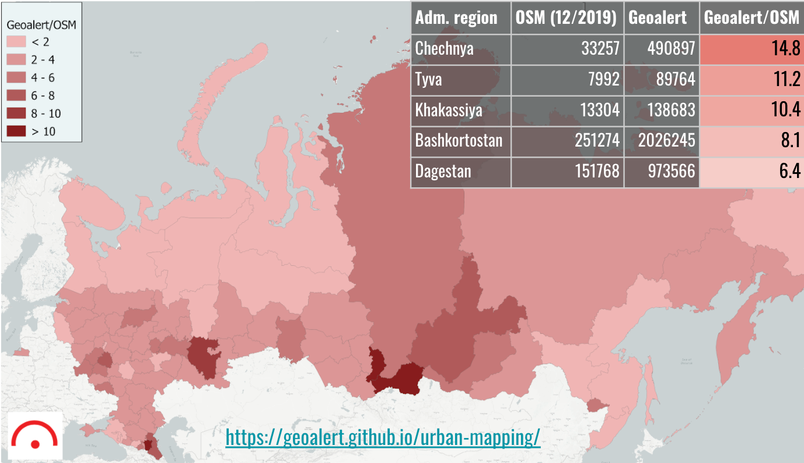

# Open Urban Mapping

Introduction
------------
Buildings are commonly put on a map by digitizing their shapes in satellite imagery. If done manually, this can be a time-consuming and expensive task. This project attempts to automate this process by delegating the digitizing routine to **neural networks**. It is now possible to digitize every building in the world using **computer vision and satellite imagery**. We strive to contribute some of our results to the community by filling the data gaps in [OpenStreetMap (OSM)](https://www.openstreetmap.org) buildings coverage.      

## The ongoing progress of Urban Mapping

In the map below, we've transformed both Geoalert and OSM polygons into points by taking their centroids and compared the results (as of Dec 2019, Russia). [Vector tiles](https://en.wikipedia.org/wiki/Vector_tiles) are used to visulalize both layers.

### [View map](https://geoalert.github.io/urban-mapping/) 


To continue the research and implementation of Urban Mapping premium tehnology we did a few pilot projects with commercial companies. (E.g. [the description and the dataset](https://github.com/Geoalert/vidnoe_benchmark) created with Russian Post)

To learn more about the project [read our blog](https://medium.com/geoalert-platform-urban-monitoring/urban-mapping-54-m-buildings-in-russia-10dc942ac2c4)


## Buildings Statistics - Russia

Based in Russia, we've picked its territory as our testing ground. By now we've automaticaly extracted **54+ mln building features** using different satellite imagery sources. We compared our statistics with OSM by buildings count. The statistics are displayed by [region](https://en.wikipedia.org/wiki/Federal_subjects_of_Russia).



[**Click here to download the source dataset in GeoJSON**](https://filebrowser.aeronetlab.space/s/INc6jlnQ8UTV6q6)


## Open Urban Mapping - Russia

Open datasets are created based on ["Mapbox satellite"](https://www.mapbox.com/maps/satellite) to be compatible with Openstreetmap license and contribution guides ([#License](#license)).
As Mapbox satellite has comparatively poor quality for Russian territory, we are starting from, the data has to be validated quite carefully. The data for Russia is going to be updated by regions according to priority based on higher count ratio comparing to OSM.

|Country|Region|Building heights| Building classes |Feature count| Count ratio, OSM, sep 2020 | Format|Size (unzipped)|
|-------------|------------|----------|----------|-----------|------------|------------|-------------|
|Rus|[**Chechnya**](https://bit.ly/30voBD4)| - | ✓ | 219,537| 6.5 | GeoPackage | 53Mb |

## Mapping contribution - use cases
If you are Openstreestmap contributor you can use this data to contribute and accelerate your mapping efforts. Since the data is generated automatically it shouldn't be imported before you check and validate. You can preview this data using Quantum GIS, whatever you want, and to edit it locally in Openstreetmap ID ("custom Map Data"). You better also check [OSM imports community guidelines] https://wiki.openstreetmap.org/wiki/Import/Guidelines

The auto-mapping approach also can be used to help creating maps from scratch in case of emergencies as in [Irkutsk region, Russia, that was heavily flooded in the summer 2019](https://geoalert.github.io/Irkutsk-flood/) - so we appreciate any contribution and/or related data requests.

If you have time to help with documentation, integration of datasets into third-party applications like JOSM, Rapid, etc. to help promoting this project, please check for the [issues](https://github.com/Geoalert/urban-mapping/issues) or create one. Contact us directly at [hello@geoalert.io](mailto:hello@geoalert.io)

## Classification
Here is the generalized classification of buildings. We are looking to include more classes and improve the accuracy.

<table>
  <tr>
   <td><strong>ID</strong>
   </td>
   <td><strong>Class name</strong>
   </td>
   <td><strong>Description</strong>
   </td>
   <td width="130px"><strong>Visual</strong>
   </td>
  </tr>

  <tr>
   <td><p style="text-align: right">
101</p>

   </td>
   <td>Residential buildings
   </td>
   <td>Roof outline (roof projection to the footprint) of the residential multi-storey buildings of different construction types
   </td>
   <td>
   </td>
  </tr>
 
  <tr>
   <td><p style="text-align: right">
102</p>

   </td>
   <td>Houses
   </td>
   <td>
    Private houses (usually representing a single household)
   </td>
   <td>
   </td>
  </tr>
 
 <tr>
   <td><p style="text-align: right">
103</p>

   </td>
   <td>Industrial buildings
   </td>
   <td>Plants, large hangars, warehouses, etc.
   </td>
   <td>
   </td>
  </tr>
  
  
 <tr>
   <td><p style="text-align: right">
104</p>

   </td>
   <td>Commercial buildings
   </td>
   <td>Offices, retail, etc.
   </td>
   <td>
   </td>
  </tr>

  <tr>
   <td><p style="text-align: right">
105</p>

   </td>
   <td>Other non-residential buildings
   </td>
   <td>Garages, transformer boxes, small hangars, etc.
   </td>
   <td>
   </td>
  </tr>
 </table>

## License
The "Open Urban Mapping" project data is licensed under the [Open Database License (ODbL)](https://opendatacommons.org/licenses/odbl/) which is compatible with OSM.
The input data is copyrighted by the data providers but is not distributed along with the dataset. The Mapbox Terms of Service states that 
```You may use Studio or third-party software to trace Mapbox maps solely comprised of satellite imagery ("Mapbox Satellite Imagery") and produce derivative vector datasets for non-commercial purposes and for OpenStreetMap. (https://www.mapbox.com/legal/tos/#[YmuSEapb)```

## Technical details
* Coordinate reference system - EPSG: 4326
* Data format - GeoPackage or GeoJSON


## References
* [Subscribe to Geoalert blog](https://medium.com/@geoalert)
* [Microsoft buildings footprints](https://github.com/microsoft/USBuildingFootprints)
* [RapID - Facebook editor for OpenStreetMap](https://github.com/facebookincubator/RapiD)
* [Comparison of MS building footprints and OpenStreetMap by Azavea](https://demos.azavea.com/building-footprint-comparison/)
---------------------------
* Our project was supported by [Skolkovo Institute of Science and Technology](https://www.skoltech.ru/en)

<image src="https://cdn.skoltech.ru/img/logo.png" width="190">
